# Java IDE
Download and install IntelliJ IDEA community edition at: https://www.jetbrains.com/idea/download

# A local development directory

Create a local development directory. In the following I assume a directory named **obp2-project**.

```console
   mkdir obp2-project
```

# Some properties for gradle
If you already have the file **~/.gradle/gradle.properties** in your home directory, append the following lines to it.

```properties
OBP2ReadOnlyMavenRepository=http://mocs-artefacts.ensta-bretagne.fr/maven_repository/
OBP2PublishMavenRepository=placeholder
```

Alternativelly, you can copy the gradle.properties file in the ~/.gradle/ directory

```console
cp obp2-devel/gradle.properties ~/.gradle/gradle.properties
```

# Repository Clones

- Clone the root project **obp2-devel** which imports the available modules

```console
git clone git@github.com:plug-obp/obp2-devel.git
``` 

- Clone **obp2-core** which contains the core interfaces & verification algorithms
```console
git clone -b v1.0 git@bitbucket.org:plug-team/plug-core.git obp2-core
```

- Clone **obp2-core-ui** which contains the command-line and graphical interfaces
```console
git clone -b v1.0 git@bitbucket.org:plug-team/plug-core-ui.git obp2-core-ui
```

- Clone **obp2-runtime-remote**, which contains the implementation of the socket connection to a *client language server* (i.e. Python)
```console
git clone -b v1.0 git@github.com:plug-obp/plug-runtime-remote.git obp2-runtime-remote
```

# Open gradle project in IntelliJ IDEA 
Select **Open** in the Projects tab of the IntelliJ welcome screen. Or alternatively **File>>Open**
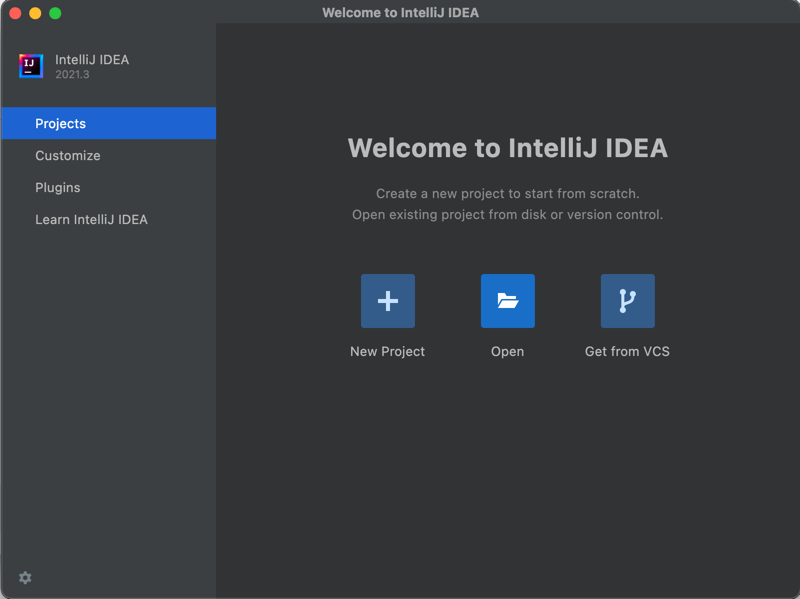

Navigate to *obp2-devel* folder in you local development directory. Select the *build.gradle* file.
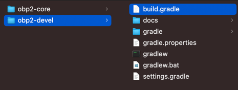

Open the **build.gradle** file as a project.

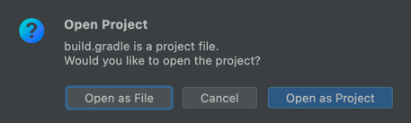

Trust the project :))

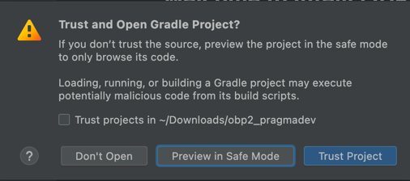

On the right-hand side of the IntelliJ window you have a *Gradle* tab. 
Click on it, and select **Reload All Gradle Projects** button. This will import the obp2 packages in IntelliJ.

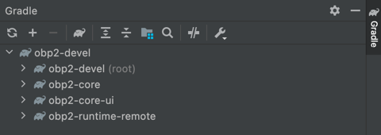

Open **Gradle Settings** 

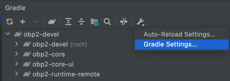

Select IntelliJ IDEA from the combobox for **Build and run using** and **Run tests using**.
Click OK.

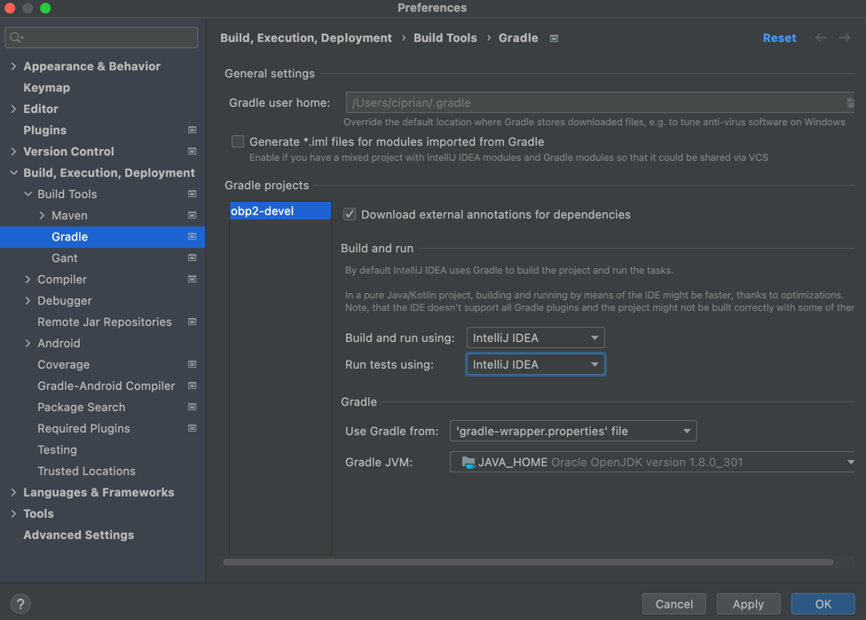

Build the project.

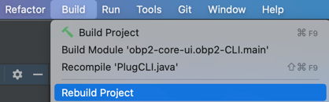

To run the generic command-line version, right-click on **obp2-core-ui/obp2-CLI/src/obp2.cli/PlugCLI** and select *Run*.
For debugging you can select *Debug* button.

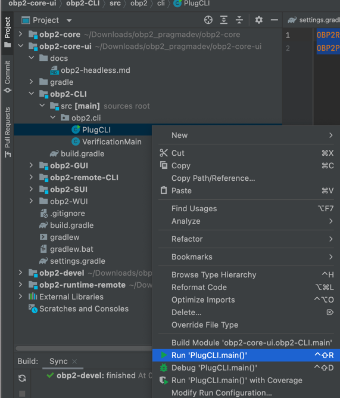

To run the command-line version with the --language-server option, right-click on 
**obp2-core-ui/obp2-remote-CLI/src/obp2.cli/PlugRemoteCLI** and select *Run*.
For debugging you can select *Debug* button.

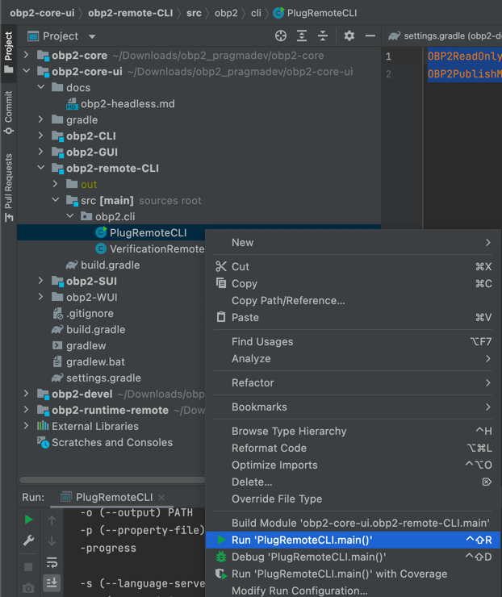

To run the Graphical User Interface, right-click on **obp2-core-ui/obp2-GUI/src/obp2/ui2/PlugUI** and select *Run*.
For debugging you can select *Debug* button.

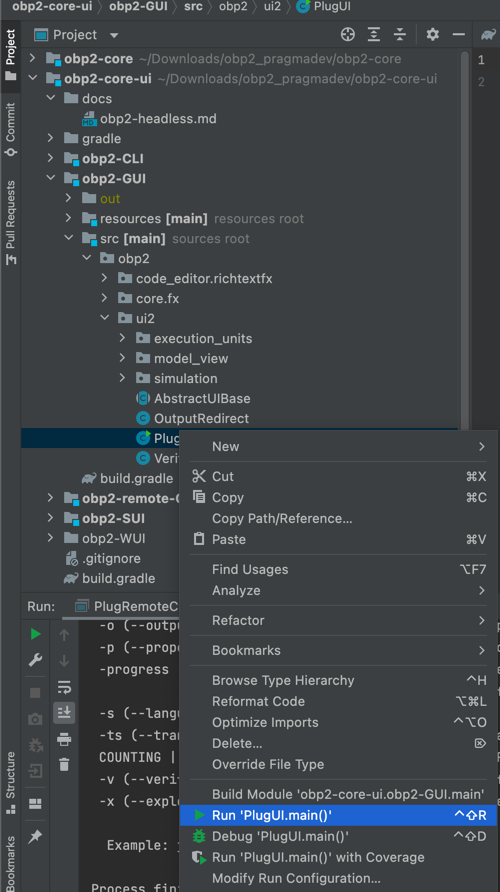